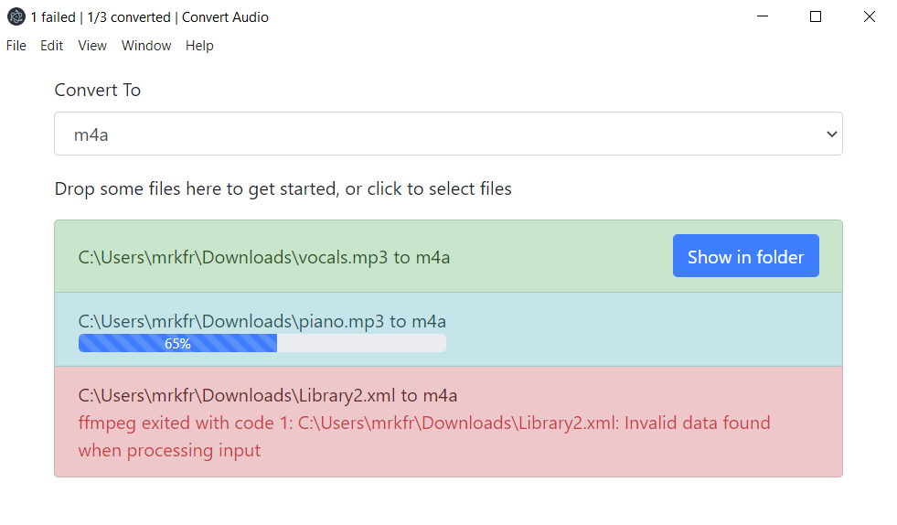

# Convert Audio

A desktop app that converts audio files from one audio format to another. It can also extract audio from video files, and convert that to a specified format.

Supports converting to the following formats (thanks to [ffmpeg](https://ffmpeg.org/)):

- aac
- flac
- flv
- m4a
- mp3
- ogg
- opus
- wav
- webm
